# Tree Models

## Introduction to Decision Trees
Welcome to the module ‘Tree Models’. In this module, we will study two extremely popular machine learning models —  **decision trees and random forests**. 

You will begin with **decision trees** and move on to **random forests**, which are a collection of multiple decision trees. A collection of multiple models is called an **ensemble**.

With high interpretability and an intuitive algorithm, decision trees mimic the human decision-making process and excel in dealing with categorical data. Unlike other algorithms such as logistic regression or SVMs, decision trees do not find a linear relationship between the independent and the target variable. Rather, they can be used to **model highly nonlinear data.**

With decision trees, you can easily explain all the factors leading to a particular decision/prediction. Hence, they are easily understood by business people. They form the building blocks for random forests, which are very popular algorithms among the kaggle community.

Random forests, being **collections of multiple trees**, are one of the most successful and popular models in machine learning. By the end of this module, you will be able to use decision trees and random forests to solve classification problems.

## Introduction to Decision Trees
As the name goes, a decision tree uses a tree-like model to make predictions. It resembles an upside-down tree. It is also very similar to how you make decisions in real life: you ask a series of questions to arrive at a decision.

A decision tree splits the data into multiple sets. Then, each of these sets is further split into subsets to arrive at a decision.

For instance if a doctor is trying to make a decision about what the line of treatment will be for a patient visiting the doctor, what the diagnosis is based on the patient condition. The typical thought process in the doctor's mind would probably goes something like this:

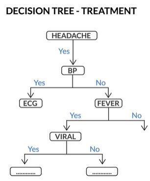

Essentally we can imagine the decision making process by a doctor as a series of nested if and then else. If something happens then do something else do something else. So its very easy to imagine it as a tree, which is what a decision tree is.

We saw that decision trees use a very natural decision-making process: asking a series of questions in a nested if-then-else structure. Let’s look at some real examples and understand trees better.

On each node, you ask a question to further split the data held by the node. If the test passes, you go left; otherwise, you go right.In the heart disease example shown above, the leaf nodes (bottom) are labelled yes (the person has heart disease) or no (the person doesn’t have heart disease).

The decision tree predicts that if, ‘Thal’ is not equal to 3, ‘coloured fluoroscopy’ is less than 0.5, ‘exercise.angina’ is equal to 0, and ‘age’ is less than 51, then the person will have heart disease. Similarly, there are three other paths which lead to a yes labelled leaf.

## Interpreting a Decision Tree
Now if a model predicts that a data point belongs to class A, how do you figure out which attributes were the most important predictors? Decision trees make it very easy to determine the important attributes. Let’s understand this with an example.

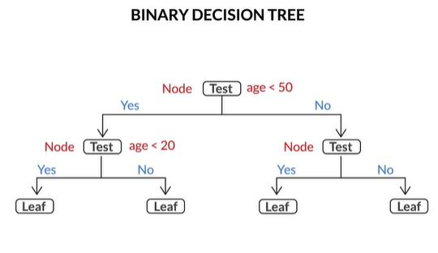

So, if a test splits the data into more than two partitions, this is called a **multiway decision tree**.  
The decision trees are easy to interpret. Almost always, you can identify the various factors that lead to the decision. In fact, trees are often underestimated for their ability to relate the predictor variables to the predictions. As a rule of thumb, if interpretability by laymen is what you're looking for in a model, decision trees should be at the top of your list.

So the decision trees can go back and tell you the factors leading to a given decision. In SVMs, if a person is diagnosed with heart disease, you cannot figure out the reason behind the prediction. However, a decision tree gives you the exact reason, i.e. either 'Thal is 3, the pain type is neither 1, nor 2, nor 3, and the coloured fluoroscopy is greater than or equal to 0.5', or 'Thal is not equal to 3, and either of the three tests, shown in the right half of the tree, failed'.

Consider the heart disease decision tree again. Given that a patient is diagnosed with heart disease, you can easily trace your way back to the multiple tests that would have led to this diagnosis. One such case could be where the patient doesn’t have thal = 3, and coloured fluoroscopy is greater than or equal to 0.5.

In other words, each decision is reached via a path that can be expressed as a series of ‘if’ conditions satisfied together, i.e., **if** ‘thal’ is not equal to 3, and **if** coloured fluoroscopy is greater than or equal to 0.5, then the patient has heart disease. Final decisions in the form of class labels are stored in leaves.

### Comprehension - Decision Tree Classification in Python
Let’s look at the heart disease data set we discussed in the lecture. The data lists various tests that were conducted on patients and some other details. Now you want to predict if a person has heart disease or not, given the test results and other attributes.

[Heart Disease Data Set](dataset/heart.csv)

For a better understanding of the data set, please check the attribute information on the UCI website (https://archive.ics.uci.edu/ml/datasets/Statlog+%28Heart%29).

Heart disease = 1 means the person **doesn’t have** heart disease  
Heart disease = 2 means the person **has** heart disease

For simplicity and to focus on building a decision tree only, we are skipping any EDA or feature manipulation. Also, the entire data set has been used as the **training set**. Just run the given Python notebook and build the decision tree on the **entire data set**, using the **default parameters** of the  DecisionTreeClassifier() function.

[Python Code](dataset/Decision+Tree---Heart+Disease.ipynb)

## Regression with Decision Trees
There are cases where you cannot directly apply linear regression to solve a regression problem. Linear regression will fit only one model to the entire data set; whereas you may want to **divide the data set into multiple subsets** and apply linear regression to each set separately. Let’s see how decision trees help in such a case.

Suppose we want to predict weight of a person given his/her age and height then:

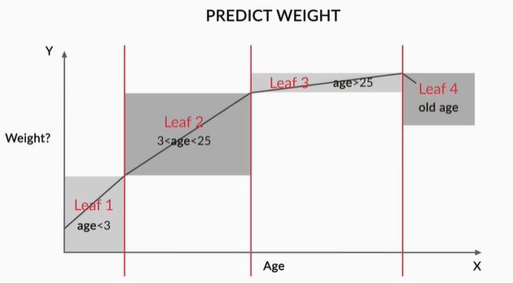

In the above plot curve we can see that there is no single linear model which can capture all of that. So what we can do is break it up into regions and within each region, we can expect a clean linear model for the datapoints which fall within that particular interval. So the model which we are trying to build to predict the weight given age and height is not a single linear model but it consist of pieces and those pieces in this case are defined by the age bracket to which the person belongs and for each interval now there is a regualar linear model.

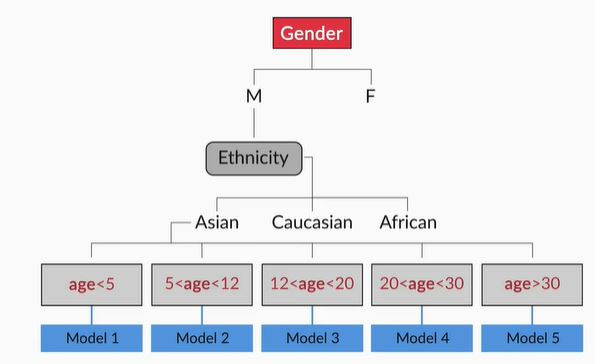

In regression problems, a decision tree splits the data into multiple subsets. The difference between decision tree classification and decision tree regression is that in regression, **each leaf represents a linear regression model**, as opposed to a class label.

In this module, we won't study decision tree regression in detail, but only decision tree classification because that is what you’ll most commonly work on. However, remember that if you get a data set where you want to perform linear regression on multiple subsets, decision tree regression is a good idea.

Additional Readings:

Decision Trees scikit-learn documentation(http://ogrisel.github.io/scikit-learn.org/sklearn-tutorial/modules/tree.html)

## Algorithms for Decision Tree Construction

### Introduction
Welcome to the session **Algorithms for Decision Tree Construction**. In the previous session, you learnt about the underlying concepts of decision trees and their interpretation. We also saw how decision trees solve regression problems that cannot be handled by linear regression. In this session, you will see how decision trees are constructed, i.e. you will understand the learning algorithms behind decision trees.

## Concept of Homogeneity
Given 10 attributes, how do you decide which attribute to split on first? Should you randomly select an attribute and split the data set on it? Or should there be a selection criterion to choose a particular attribute ahead of the other nine attributes? 

We will learn about the various algorithms involved in decision tree construction. 
If a partition contains data points with identical labels (say, label 1), then you can classify the entire partition as label 1. But this is a rather oversimplified example. In real-world data sets, you will almost never get completely homogenous data sets (or even nodes after splitting). So try to do the best you can, i.e. try to split the nodes such that the resulting nodes are **as homogenous as possible**.

If the node is blood pressure, try and split it with a rule such that all the data points that pass the rule have one label (i.e. is as homogenous with as possible), and those that don't, have another.

Always try to generate partitions that result in homogeneous data points. For classification tasks, a data set is **completely homogeneous** if it **contains only a single class label**. Let’s look at another example to understand homogeneity.

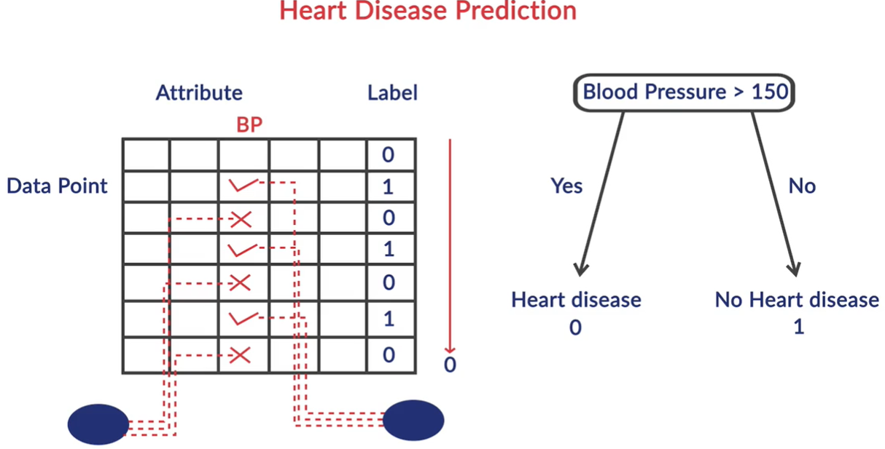

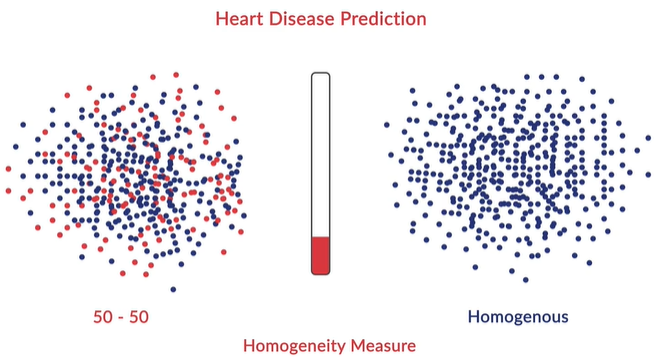

More the variation in the dataset means less the homogeneity.

Now that we are familiar with the concept of homogeneity, let’s look at the **generic algorithm** that decision trees follow to split data sets.

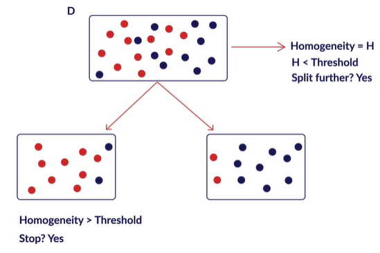

So you go step-by-step, picking an attribute and splitting the data such that the homogeneity increases after every split. You stop splitting when the resulting leaves are sufficiently homogenous. What is sufficiently homogenous? Well, you define the amount of homogeneity which, when achieved, the tree should stop splitting further. 

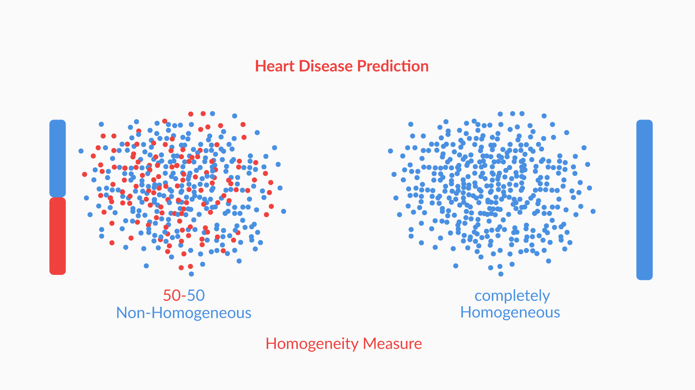

A split that gives you a homogenous subset is much more desirable than the one that results in a 50-50 distribution (in the case of two labels). All the data points belong to one label in a completely homogeneous set.

In the next section, we'll look at specific methods that are used to measure homogeneity, namely the Gini index, entropy and information gain (for classification), and R-squared (for regression).

**Notes** 
1. Completely homogeneous: All the data points belong to only one class label, and so this data set is completely homogeneous.
2. The ultimate aim of decision tree splitting is to Increase homogeneity.More homogeneity will mean that most of the data points in the set belong to the same class label. Hence, classifying all the data points of that set, to get them to belong to that class, will result in lesser errors.

## Gini Index
You have narrowed down the decision tree construction problem to this: you want to split the data set such that the **homogeneity of the resultant partitions is maximum**. But how do you measure this homogeneity?

There are various ways to quantify homogeneity, such as the **Gini index, information gain, entropy**, etc. 

A popular measure is know as Gini Index. This builds the homogenity value for the dataset based on the probabilities of different labels that occur in the dataset.

Let us take a dataset of employee where we need to predict if an employee plays football or not.

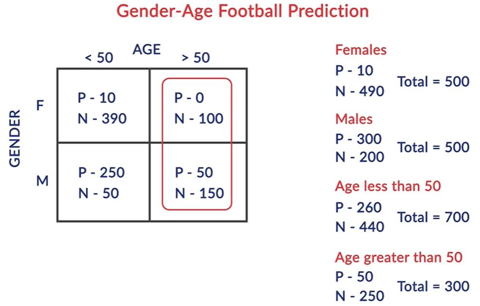

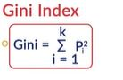

which is sum of the squares of the probablity for various labels as the measure of homogeneity.

**Example**

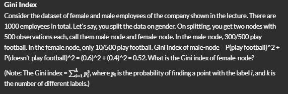

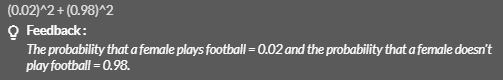

The **total Gini index** if you split on gender will be  
Gini Index(gender) = (fraction of total observations in male-node) * Gini index of male-node + (fraction of total observations in female-node) * Gini index of female-node.

Similarly, you can also calculate the Gini index of the split on age and compare that with the Gini index of the split on gender that you calculated. You then choose the attribute that has the higher Gini index. 

Assume that you have a data set with 2 class labels. If the data set is completely homogeneous (all the data points belong to label 1), then the probability of finding a data point corresponding to label 2 will be 0 and that of label 1 will be 1. So **p1 = 1**, and **p2 = 0**. The Gini index, equal to 1, will be the highest in such a case. The higher the homogeneity, the higher the Gini index.

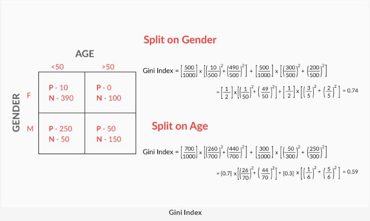

‘Gender’ is a better attribute to split on as it yields a higher value of Gini index as compared to ‘age’. This means that gender gives a better split that helps distinguish between football players and non-football players. This is intuitive as well: splitting on gender is expected to be more informative than age; this is because football is usually more popular among males.

You had to make a choice between two splits: age and gender. The Gini index of splitting on gender is higher than that of splitting on age; so you go ahead and split on gender. 

## Entropy and Information Gain
We will now look at one more homogeneity measure: **information gain**. The idea is to use the notion of entropy. Entropy quantifies the degree of disorder in the data, and like the Gini index, its value also varies from 0 to 1.

If a data set is **completely homogenous**, then the **entropy of such a data set is 0**, i.e. there’s no disorder. 

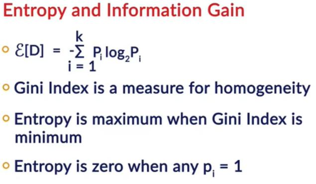

The entropy is given by

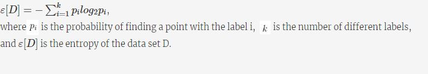

### Information Gain
We will now look at **information gain**. It measures **how much the entropy has decreased** between the parent set and the partitions obtained after splitting.

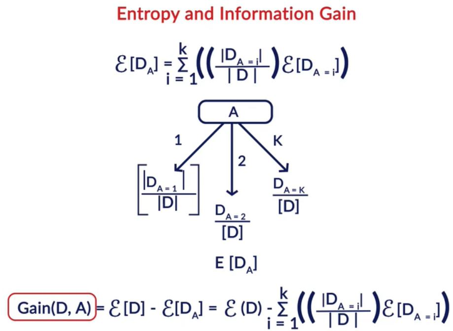

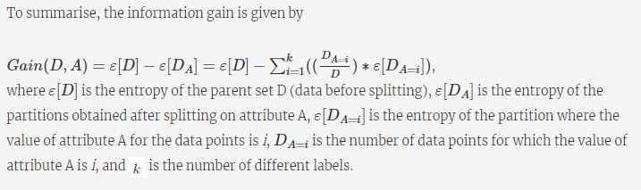

Let's consider an example. You have four data points out of which two belong to the class label '1', and the other two belong to the class label '2'. You split the points such that the left partition has two data points belonging to label '1', and the right partition has the other two data points that belong to label '2'. Now let's assume that you split on some attribute called 'A'.

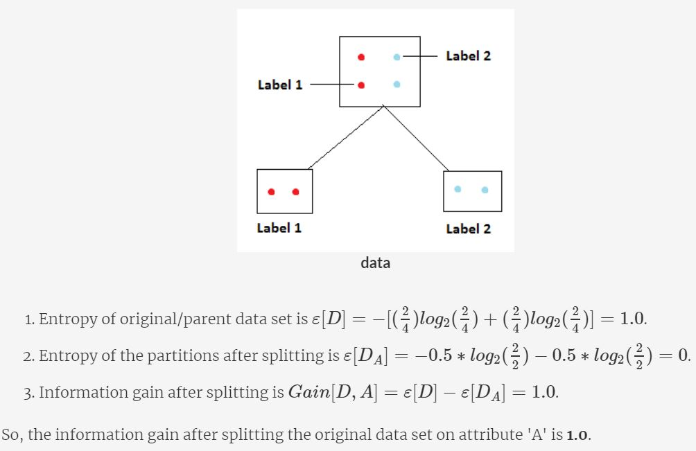

## Splitting by R-squared
So far, you looked at splits for discrete target variables. But how is splitting done for continuous output variables? You calculate the 
R2(r-sqaure) of data sets (before and after splitting) in a similar manner to what you do for linear regression models. Let’s understand this in detail with an example.

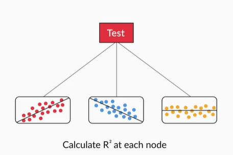

So split the data such that the R2 of the partitions obtained after splitting is greater than that of the original or parent data set. In other words, the fit of the model should be as ‘good’ as possible after splitting.

In this module, you won't study decision tree regression in detail, but only decision tree classification, because that is what you’ll most commonly work on. However, remember that if you get a data set where you want to perform linear regression on multiple subsets, decision tree regression is a good idea.

**Additional Reading**  
Decision Trees - PPT(https://www.slideshare.net/21_venkat/decision-tree-53154033)

## Truncation and Pruning

### Introduction
Welcome to the session on **'Truncation and Pruning'**. In the previous session, you learnt about the concepts of homogeneity and the various measures of homogeneity. In this session, you will first look into the advantages and disadvantages of decision trees. Then, you will learn about various truncation and pruning strategies that are used to overcome one of the biggest disadvantages of trees: overfitting.

### Advantages and Disadvantages
Decision trees are very intuitive and promising algorithms for dealing with categorical attributes. Let’s look at some of their advantages.

 The advantages are:
 * Predictions made by a decision tree are easily interpretable.
* A decision tree does not assume anything specific about the nature of the attributes in a data set. It can seamlessly handle all kinds of data — numeric, categorical, strings, Boolean, and so on.
* It does not require normalisation since it has to only compare the values within an attribute.
* Decision trees often give us an idea of the relative importance of the explanatory attributes that are used for prediction.

So should decision trees be used for every case? Not really.  Let’s look at the problems associated with decision trees.

The disadvantages are:
* Decision trees tend to overfit the data. If allowed to grow with no check on its complexity, a tree will keep splitting till it has correctly classified (or rather, mugged up) all the data points in the training set.
* Decision trees tend to be very unstable, which is an implication of overfitting. A few changes in the data can change a tree considerably.

### Tree Truncation
Earlier, you saw that decision trees have a strong tendency to overfit the data, which is a serious problem. So you have to keep an eye on the size of the tree. A very large tree will have a leaf just to cater to a single data point.

There are two broad strategies to control overfitting in decision trees: **truncation and pruning**. Let's study how these two techniques help control overfitting.

There are two ways to control overfitting in trees:
1. **Truncation** - Stop the tree while it is still growing so that it may not end up with leaves containing very few data points.
2. **Pruning** - Let the tree grow to any complexity. Then, cut the branches of the tree in a bottom-up fashion, starting from the leaves. It is more common to use pruning strategies to avoid overfitting in practical implementations.

**Example of trucation**

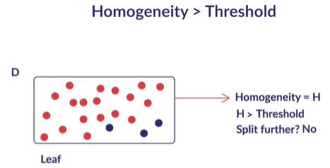

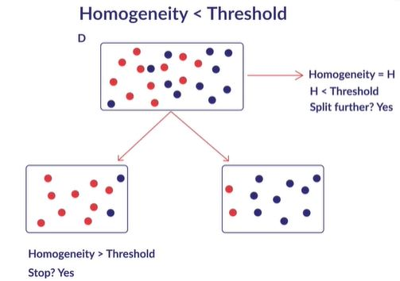

Note that truncation is also known as pre-pruning.Let’s look into various ways in which you can truncate a tree:

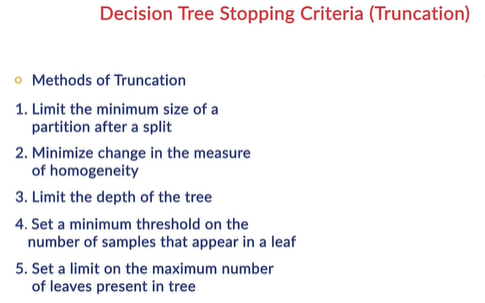

Though there are various ways to truncate or prune trees, the DecisionTreeClassifier function in sklearn provides the following hyperparameters which you can control:

1. **criterion (Gini/IG or entropy)**: It defines the function to measure the quality of a split. Sklearn supports “gini” criteria for Gini Index & “entropy” for Information Gain. By default, it takes the value “gini”.
2. **max_features**: It defines the no. of features to consider when looking for the best split. We can input integer, float, string & None value.
    1. If an integer is inputted then it considers that value as max features at each split.
    2. If float value is taken then it shows the percentage of features at each split.
    3. If “auto” or “sqrt” is taken then max_features=sqrt(n_features).
    4. If “log2” is taken then max_features= log2(n_features).
    5. If None, then max_features=n_features. By default, it takes “None” value.
3. **max_depth**: The max_depth parameter denotes maximum depth of the tree. It can take any integer value or None. If None, then nodes are expanded until all leaves are pure or until all leaves contain less than min_samples_split samples. By default, it takes “None” value.
4. **min_samples_split**: This tells above the minimum no. of samples required to split an internal node. If an integer value is taken then consider min_samples_split as the minimum no. If float, then it shows percentage. By default, it takes “2” value.
5. **min_samples_leaf**: The minimum number of samples required to be at a leaf node. If an integer value is taken then consider - -min_samples_leaf as the minimum no. If float, then it shows percentage. By default, it takes “1” value.

There are other hyperparameters as well in DecisionTreeClassifier. You can read the documentation in python using:  
*help(DecisionTreeClassifier)*

### Tree Pruning
Tree pruning is a method of chopping off parts of a tree once it is fully grown. It is a bottom-up approach used to solve the problem of overfitting. 

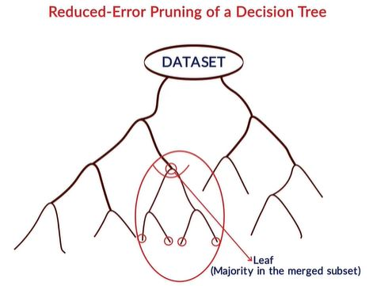

In pruning, you chop off the tree branches; this results in a decrease in tree complexity. It also helps in reducing overfitting.But how do you decide if a branch should be pruned or not?

Before proceeding, please note that the data set is divided into three parts: the training set, the validation set and the test data. The validation set is used to tune hyperparameters, i.e. after deciding on a set of hyperparameters for a tree, you check the accuracy of the tree on the validation set.

You check the performance of a pruned tree on a validation set. If the accuracy of the pruned tree is higher than the accuracy of the original tree (on the validation set), then you keep that branch chopped. Remember that the validation set is the second part of the data set, the first and third being the training and test set.

**Additional Reading**  
Pruning the Tree(https://stackoverflow.com/questions/39002230/possible-to-modify-prune-learned-trees-in-scikit-learn)

### Building Decision Trees in Python
In this session, we will build a decision tree model in python.

We will build a tree to predict the income of a given population, which is labelled as <= 50K and >50K. The attributes (predictors) are age, working class type, marital status, gender, race etc.

[Data Set](dataset/adult_dataset.csv)

[Python Code](dataset/Decision_Tree_Income_Prediction.ipynb)

We will first have to clean and prepare the data in a format which sklearn can understand.Let's now understand the two most common ways of preparing categorical variables - **dummy variables/one hot encoding** and **label encoding**.

However, you should avoid doing that in decision trees (or other tree-based, non-linear models such as random forests), since there's a better way to represent categorical variables in tree models - **label encoding**. 

In previous models such as linear and logistic regression, you had created dummy variables for categorical variables, since those models (being mathematical equations) can process only numeric variables.

All that is not required in decision trees, since they can process categorical variables easily using label encoding. 

Now let's build the model with default parameters and try to visualize decision tree in python.

### Choosing Tree Hyperparameters in Python
How do you control the complexity (or size) of a tree? A very ‘big’ or complex tree will result in overfitting. On the other hand, if you build a relatively small tree, it may not be able to achieve a good enough accuracy (i.e. it will underfit).

So what values of hyperparameters should you choose? As you would have guessed, you can use grid search cross-validation to find the optimal hyperparameters.

To summarise, there are multiple hyperparameters in a decision tree such as max_depth, min_samples_leaf, min_samples_split, etc. 

You are requested to read the documentation of sklearn DecisionTreeClassifier and understand the meanings of the hyperparameters. The following questions are based on the documentation.

 The tree tends to overfit at high values of max_depth and low values of min_samples_leaf. Note that decision trees are notorious for overfitting - they achieve 100% training accuracy if allowed to grow too deep (while the test accuracy is of course quite lesser).

 Until now, we were interested in understanding the individual effects of hyperparameters to understand how they affect the resulting tree. Now, let's find the optimal combination of the hyperparameters.

 As you may have guessed, we will now use GridSearchCV to find the optimal combination of hyperparameters together. Note that this time, we'll also specify the criterion (gini/entropy or IG), which is a hyperparameter of decision trees.

 ## Random Forests
 Welcome to the session on '**Random Forests**'. A random forest is almost always better than a single decision tree. This is the reason why it is one of the most popular machine learning algorithms, especially in the online machine learning competition platforms, such as Kaggle.

 ### Ensembles
 In this session, you’ll learn about random forests: one of the most popular algorithms in machine learning. Random forests use a technique known as **bagging**, which is an **ensemble** method. So before diving into random forests, let's first understand ensembles.

 An ensemble means a group of things viewed as a whole rather than individually. In ensembles, a **collection of models** is used to make predictions, rather than individual models. Arguably, the most popular in the family of ensemble models is the random forest: an ensemble made by the **combination of a large number of decision trees**.

 In principle, ensembles can be made by combining all types of models. An ensemble can have a logistic regression, a neural network, and few decision trees working in unison.

 Naturally, a few questions arise before you understand how ensembles work:
 1. Why should a **collection of models work better** than individual ones?
 2. How do you **choose the individual models** to form the ensemble, so that it is better than any of the individual models themselves?

 ### Diversity and Acceptability
 Ensembles of models are somewhat analogous to teams of individual players. If you were to choose a football team, there would be two things you’d do:
 1. Choose people with different skill sets, such as defenders, attackers, and a goalkeeper, to ensure **diversity**, and
 2. Choose good players, i.e. ensure that all players are acceptable from a skill set point of view (and at least better than a regular person).

 **Diversity** ensures that the models serve **complementary** purposes, which means that the individual models make predictions **independent of each other**. The advantages of this are different depending on the type of ensemble.

 For example, a random forest is an ensemble with a large number of trees as individual models. Diversity ensures that even if some trees overfit, the other trees in the ensemble will neutralise the effect. The independence among the trees results in a **lower variance** of the ensemble compared to a single tree. We will soon discuss how the learning algorithm is designed to achieve independence, and how this is beneficial.

 **Acceptability** implies that each model is at least **better than a random model**. This is a pretty lenient criterion for each model to be accepted into the ensemble, i.e. it has to be at least better than a random guesser.

 But how can you guarantee that if you fulfil these two conditions to make an ensemble, it will be better than any individual model?

 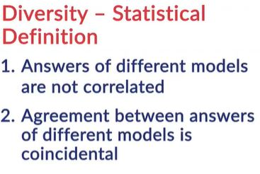

  Now, to understand how an ensemble makes decisions, consider an ensemble with 100 models comprising of decision trees, logistic regression models, etc. Given a new data point, each model will predict an output y for this data point. If this is binary classification, then you simply take the majority score. If more than 50% models say y = 0, you go with 0 and vice-versa.

 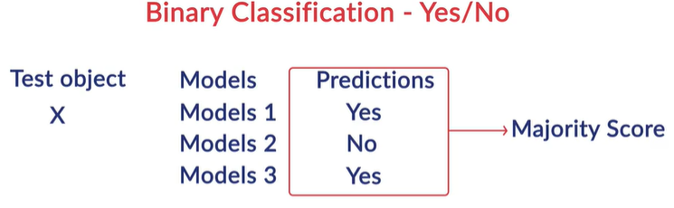

  Now, to understand how an ensemble makes decisions, consider an ensemble with 100 models comprising of decision trees, logistic regression models, etc. Given a new data point, each model will predict an output y for this data point. If this is binary classification, then you simply take the majority score. If more than 50% models say y = 0, you go with 0 and vice-versa.

  Firstly, if each of the individual models is **acceptable**, i.e.they’re wrong with a probability less than 50%, you can show that the probability of the ensemble being wrong (i.e. the majority vote going wrong) will be far lesser than that of any individual model.

  Also, the ensembles avoid getting misled by the **assumptions made by individual models**. For example, ensembles (particularly random forests) successfully reduce the problem of overfitting. If a decision tree in an ensemble overfits, you let it. Chances are extremely low that more than 50% of the models have overfitted. Ensembles make sure that you do not put all your eggs in one basket.

  ## Creating a Random Forest

  ### Bagging

  To understand random forests, you will first need to understand **bagging**, an ensemble method. Bagging stands for **bootstrapped aggregation**. It is a technique for choosing random samples of observations from a dataset. Each of these samples is then used to train each tree in the forest. 

  As you study bagging, keep in mind that it is just a **sampling technique** and is not specific to **random forests**.

  ### Random Forests
  In the bagging type of ensembles, random forests are by far the most successful. They are essentially ensembles of a **number of decision trees**. You create a large number of models (say, 100 decision trees), each one on a **different bootstrap sample**, from the training set. To get the result, you **aggregate** the decisions taken by all the trees in the ensemble.

  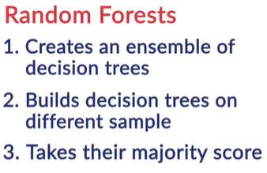

  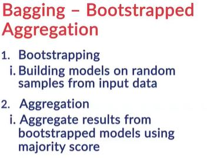

  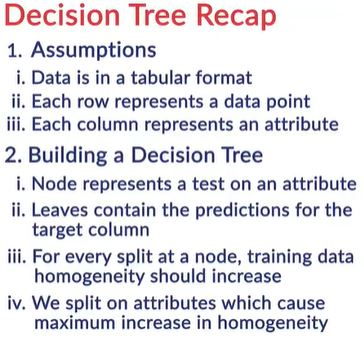

  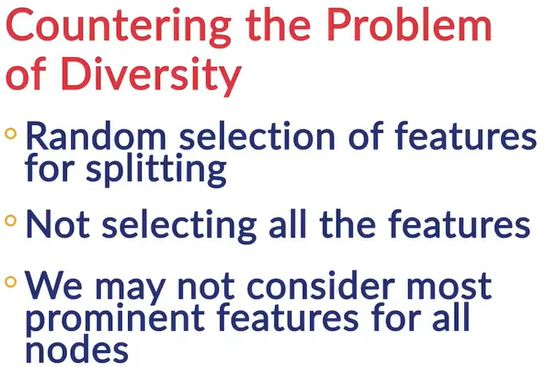

  **Bootstrapping** means creating bootstrap samples from a given data set. A bootstrap sample is created by sampling the given data set uniformly and with replacement. A bootstrap sample typically contains about 30-70% data from the data set. (A different random subset of observations is chosen, which is called the bootstrap sample, for each tree that is to be built in the forest. This is called bootstrapping.) **Aggregation** implies combining the results of different models present in the ensemble.'

  You learnt that a random forest selects a random sample of data points (bootstrap sample) to build each tree, and a random sample of features while splitting a node. Randomly selecting features ensures that each tree is **diverse**.

  Suppose you want to build a random forest of 10 decision trees. First, you will create 10 bootstrap samples from the data and then, **train** each tree on a different bootstrap sample. Finally, while predicting a test case, each tree will make a prediction, and the final prediction will be the **majority score** of all these predictions.

  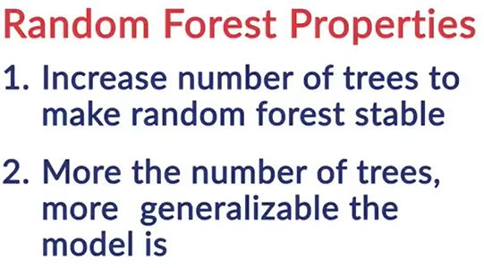

  It is worth reiterating that random forests have been much more successful than decision trees. In fact, since you learnt that ensembles are better than individual models (assuming diversity and acceptability), you can indirectly say that random forests are almost always better than decision trees! Obviously, this will be true if the trees are diverse and acceptable.

### Advantages of Random Forest
1. **Diversity** arises because you create each tree with a **subset of the attributes/features/variables**, i.e. you don’t consider all the attributes while making each tree. The choice of the attributes considered for each tree is **random**. This ensures that the trees are independent of each other.
2. **Stability arises** because the answers given by a large number of trees average out. A random forest has a **lower model variance** than an ordinary individual tree.
3. **Immunity to the curse of dimensionality**: Since each tree does not consider all the features, the feature space (the number of features a model has to consider) reduces. This makes the algorithm immune to the curse of dimensionality. A large feature space causes computational and complexity issues.
4. **Parallelizability**: You need a number of trees to make a forest. Since two trees are independently built on different data and attributes, they can be built separately. This implies that you can make full use of your multi-core CPU to build random forests. Suppose there are 4 cores and 100 trees to be built; each core can build 25 trees to make a forest.
5. **Testing /training data and the OOB or out-of-bag error**: You always want to avoid violating the fundamental tenet of learning: “not testing a model on what it has been trained on”. While building individual trees, you choose a **random** subset of the observations to train it. If you have 10,000 observations, each tree may only be made from 7000 (70%) randomly chosen observations. OOB is the mean prediction error on each training sample xᵢ, using only the trees that do not have xᵢ in their bootstrap sample. If you think about it, this is very similar to a **cross-validation error**. In a CV error, you can measure the performance on the subset of data the model hasn’t seen before.

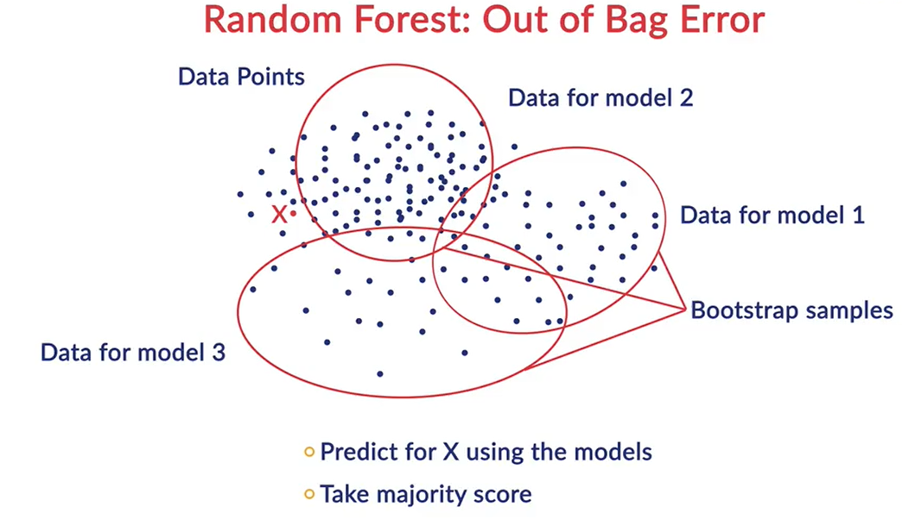

In fact, it has been proven that using an OOB estimate is as accurate as using a test data set of a size equal to the training set.Thus, the OOB error completely omits the need for set-aside test data (though you can still work with test data like you have been doing, at the cost of eating into the training data).
yhe OOB error is calculated as the number of observations predicted wrongly as a proportion of the total number of observations.

### Comprehension - OOB (Out-of-Bag) Error
In the last segment, you learnt that the OOB error is almost as good as the cross-validation error. The final prediction is the aggregation of all the predictions of individual decision trees. Remember that each tree in a random forest is only trained on a random subset of the training set, which is called a bootstrapped sample. This means that for each sample (observation), there are several trees that did not include that sample, and to these trees, this sample is unseen. Let’s understand this better.

Suppose there are N = 100 observations with M = 15 features, and the outcome variable is a categorical variable Y. Also, you build a random forest with 50 trees. The OOB is calculated as follows:

For each observation Ni,Ni is passed to all the trees that did not have it in their training. These trees then predict the class of 
Ni. The final prediction about Ni is decided by a majority vote.

Now let’s apply this to N1. Suppose 10 trees did not have N1 in their training. But these 10 trees make their prediction about N1. Let’s say 4 trees predicted 0, and the other 6 predicted 1, as the output. The final prediction about N1 will be 1.

Next, we move on to N2. Suppose 15 trees did not have N2 in their training. But these 15 trees make their prediction about N2. Let’s say 12 predicted 0, and the rest 3 predicted 1. The final prediction about N2 will be 0.

This is done for each observation in the training set. Once all the predictions for each observation are calculated, the OOB error is calculated as the number of observations predicted wrongly as a proportion of the total number of observations.

### Comprehension - Time Taken to Build a Random Forest
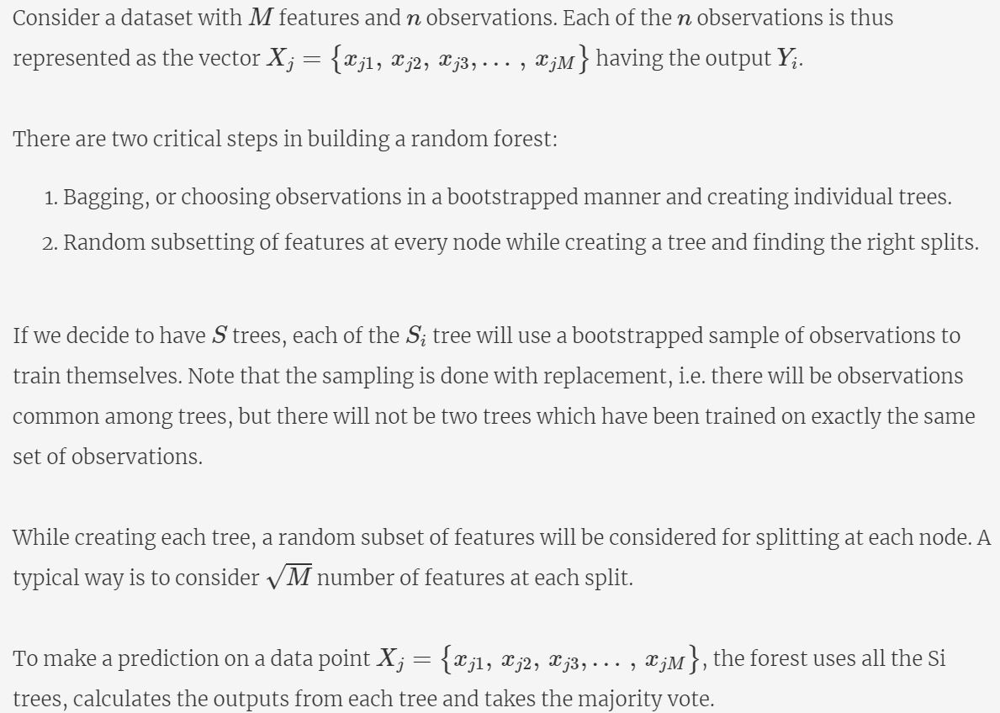

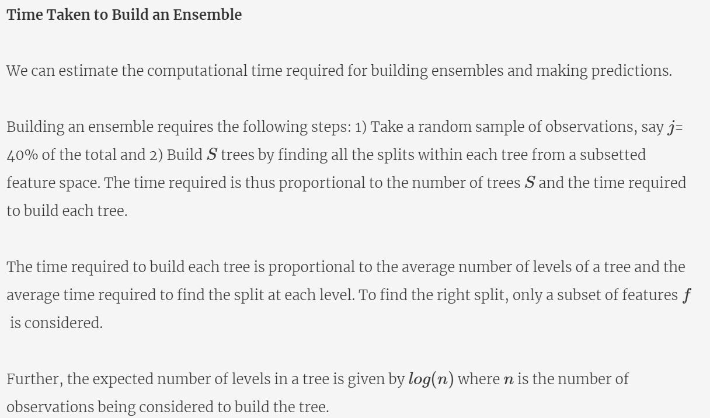

### Random Forests Lab
In this segment, you will understand how to implement **Random Forests in sklearn**. You'll experiment with hyperparameters such as the number of trees, the number of variables considered at each split, etc.

[Credit Card Default Data](dataset/credit-card-default.csv)

[Python Code](dataset/Random+Forest+-+Credit+Default+Prediction.ipynb)

Recall that random forest takes a **sample of features** while splitting each node of its component trees. You can control the number of features considered at each split by specifying the **max_features** hyperparameter.

This is one of the two additional hyperparameters in a random forest, compared to decision trees, the other one being n_estimators (the number of decision trees in the ensemble).

Let's now understand why max_features is such as important attribute while building a random forest.

To summarise, the max_features hyperparameter is a very important one while tuning a random forest, and as you will see in the next lecture, it can affect the results of the model significantly.

Now let's see the effect of the hyperparameter max_features in action find its optimum value. We will also choose the optimal combination of hyperparameters using grid search.

To summarise, you learnt how to build a random forest in sklearn. The hyperparameters in a random forest are all those that you have in a decision tree, plus two more - max_features and n_estimators. The effects of both are briefly summarised below.

#### The Effect of max_features
You saw that there is an optimal value of max_features - at very low values, the component trees are **too simple to learn anything useful**, while at extremely high values, the component trees **become similar to each other** (and violate the 'diversity' criterion). 

#### The Effect of n_estimators
Also, when you observe the plot of n_estimators and training and test accuracies, you will see that the as you increase the value of n_estimators, both the training test accuracies gradually increase. More importantly, the model does not overfit even when its complexity is increasing. This is an important benefit of random forests - you can increase the number of trees as much you like without worrying about overfitting (if your computational resources allow). 

### Summary

There is one more ensemble method: **'Boosting'**. Boosting is also a very popular method in online machine learning competitions, such as Kaggle. The basic idea is to **combine a lot of weak learners to get a strong learner. Weak learner** refers to a model that is slightly better than a model that predicts at random. Weak learners are built sequentially on top of each other, giving a boost to the overall performance of the model.

Though we haven’t covered boosting in this session, you can learn more about it in detail in later modules.