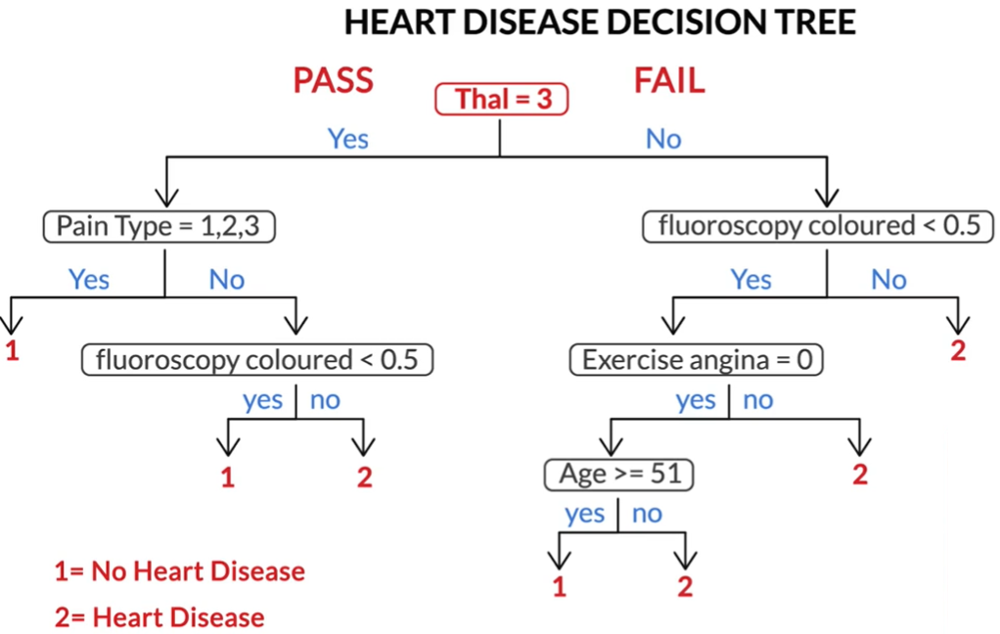
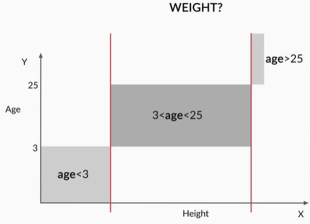

# Tree Models

## Introduction to Decision Trees
Welcome to the module ‘Tree Models’. In this module, we will study two extremely popular machine learning models —  **decision trees and random forests**. 

You will begin with **decision trees** and move on to **random forests**, which are a collection of multiple decision trees. A collection of multiple models is called an **ensemble**.

With high interpretability and an intuitive algorithm, decision trees mimic the human decision-making process and excel in dealing with categorical data. Unlike other algorithms such as logistic regression or SVMs, decision trees do not find a linear relationship between the independent and the target variable. Rather, they can be used to **model highly nonlinear data.**

With decision trees, you can easily explain all the factors leading to a particular decision/prediction. Hence, they are easily understood by business people. They form the building blocks for random forests, which are very popular algorithms among the kaggle community.

Random forests, being **collections of multiple trees**, are one of the most successful and popular models in machine learning. By the end of this module, you will be able to use decision trees and random forests to solve classification problems.

## Introduction to Decision Trees
As the name goes, a decision tree uses a tree-like model to make predictions. It resembles an upside-down tree. It is also very similar to how you make decisions in real life: you ask a series of questions to arrive at a decision.

A decision tree splits the data into multiple sets. Then, each of these sets is further split into subsets to arrive at a decision.

For instance if a doctor is trying to make a decision about what the line of treatment will be for a patient visiting the doctor, what the diagnosis is based on the patient condition. The typical thought process in the doctor's mind would probably goes something like this:

Essentally we can imagine the decision making process by a doctor as a series of nested if and then else. If something happens then do something else do something else. So its very easy to imagine it as a tree, which is what a decision tree is.

We saw that decision trees use a very natural decision-making process: asking a series of questions in a nested if-then-else structure. Let’s look at some real examples and understand trees better.

On each node, you ask a question to further split the data held by the node. If the test passes, you go left; otherwise, you go right.In the heart disease example shown above, the leaf nodes (bottom) are labelled yes (the person has heart disease) or no (the person doesn’t have heart disease).

The decision tree predicts that if, ‘Thal’ is not equal to 3, ‘coloured fluoroscopy’ is less than 0.5, ‘exercise.angina’ is equal to 0, and ‘age’ is less than 51, then the person will have heart disease. Similarly, there are three other paths which lead to a yes labelled leaf.

## Interpreting a Decision Tree
Now if a model predicts that a data point belongs to class A, how do you figure out which attributes were the most important predictors? Decision trees make it very easy to determine the important attributes. Let’s understand this with an example.

So, if a test splits the data into more than two partitions, this is called a **multiway decision tree**.  
The decision trees are easy to interpret. Almost always, you can identify the various factors that lead to the decision. In fact, trees are often underestimated for their ability to relate the predictor variables to the predictions. As a rule of thumb, if interpretability by laymen is what you're looking for in a model, decision trees should be at the top of your list.

So the decision trees can go back and tell you the factors leading to a given decision. In SVMs, if a person is diagnosed with heart disease, you cannot figure out the reason behind the prediction. However, a decision tree gives you the exact reason, i.e. either 'Thal is 3, the pain type is neither 1, nor 2, nor 3, and the coloured fluoroscopy is greater than or equal to 0.5', or 'Thal is not equal to 3, and either of the three tests, shown in the right half of the tree, failed'.

Consider the heart disease decision tree again. Given that a patient is diagnosed with heart disease, you can easily trace your way back to the multiple tests that would have led to this diagnosis. One such case could be where the patient doesn’t have thal = 3, and coloured fluoroscopy is greater than or equal to 0.5.

In other words, each decision is reached via a path that can be expressed as a series of ‘if’ conditions satisfied together, i.e., **if** ‘thal’ is not equal to 3, and **if** coloured fluoroscopy is greater than or equal to 0.5, then the patient has heart disease. Final decisions in the form of class labels are stored in leaves.

### Comprehension - Decision Tree Classification in Python
Let’s look at the heart disease data set we discussed in the lecture. The data lists various tests that were conducted on patients and some other details. Now you want to predict if a person has heart disease or not, given the test results and other attributes.

[Heart Disease Data Set](dataset/heart.csv)

For a better understanding of the data set, please check the attribute information on the UCI website (https://archive.ics.uci.edu/ml/datasets/Statlog+%28Heart%29).

Heart disease = 1 means the person **doesn’t have** heart disease  
Heart disease = 2 means the person **has** heart disease

For simplicity and to focus on building a decision tree only, we are skipping any EDA or feature manipulation. Also, the entire data set has been used as the **training set**. Just run the given Python notebook and build the decision tree on the **entire data set**, using the **default parameters** of the  DecisionTreeClassifier() function.

[Python Code](dataset/Decision+Tree---Heart+Disease.ipynb)

## Regression with Decision Trees
There are cases where you cannot directly apply linear regression to solve a regression problem. Linear regression will fit only one model to the entire data set; whereas you may want to **divide the data set into multiple subsets** and apply linear regression to each set separately. Let’s see how decision trees help in such a case.

Suppose we want to predict weight of a person given his/her age and height then:

In the above plot curve we can see that there is no single linear model which can capture all of that. So what we can do is break it up into regions and within each region, we can expect a clean linear model for the datapoints which fall within that particular interval. So the model which we are trying to build to predict the weight given age and height is not a single linear model but it consist of pieces and those pieces in this case are defined by the age bracket to which the person belongs and for each interval now there is a regualar linear model.

In regression problems, a decision tree splits the data into multiple subsets. The difference between decision tree classification and decision tree regression is that in regression, **each leaf represents a linear regression model**, as opposed to a class label.

In this module, we won't study decision tree regression in detail, but only decision tree classification because that is what you’ll most commonly work on. However, remember that if you get a data set where you want to perform linear regression on multiple subsets, decision tree regression is a good idea.

Additional Readings:

Decision Trees scikit-learn documentation(http://ogrisel.github.io/scikit-learn.org/sklearn-tutorial/modules/tree.html)

## Algorithms for Decision Tree Construction

### Introduction
Welcome to the session **Algorithms for Decision Tree Construction**. In the previous session, you learnt about the underlying concepts of decision trees and their interpretation. We also saw how decision trees solve regression problems that cannot be handled by linear regression. In this session, you will see how decision trees are constructed, i.e. you will understand the learning algorithms behind decision trees.

## Concept of Homogeneity
Given 10 attributes, how do you decide which attribute to split on first? Should you randomly select an attribute and split the data set on it? Or should there be a selection criterion to choose a particular attribute ahead of the other nine attributes? 

We will learn about the various algorithms involved in decision tree construction. 
If a partition contains data points with identical labels (say, label 1), then you can classify the entire partition as label 1. But this is a rather oversimplified example. In real-world data sets, you will almost never get completely homogenous data sets (or even nodes after splitting). So try to do the best you can, i.e. try to split the nodes such that the resulting nodes are **as homogenous as possible**.

If the node is blood pressure, try and split it with a rule such that all the data points that pass the rule have one label (i.e. is as homogenous with as possible), and those that don't, have another.

Always try to generate partitions that result in homogeneous data points. For classification tasks, a data set is **completely homogeneous** if it **contains only a single class label**. Let’s look at another example to understand homogeneity.

More the variation in the dataset means less the homogeneity.

Now that we are familiar with the concept of homogeneity, let’s look at the **generic algorithm** that decision trees follow to split data sets.

So you go step-by-step, picking an attribute and splitting the data such that the homogeneity increases after every split. You stop splitting when the resulting leaves are sufficiently homogenous. What is sufficiently homogenous? Well, you define the amount of homogeneity which, when achieved, the tree should stop splitting further. 

A split that gives you a homogenous subset is much more desirable than the one that results in a 50-50 distribution (in the case of two labels). All the data points belong to one label in a completely homogeneous set.

In the next section, we'll look at specific methods that are used to measure homogeneity, namely the Gini index, entropy and information gain (for classification), and R-squared (for regression).

**Notes** 
1. Completely homogeneous: All the data points belong to only one class label, and so this data set is completely homogeneous.
2. The ultimate aim of decision tree splitting is to Increase homogeneity.More homogeneity will mean that most of the data points in the set belong to the same class label. Hence, classifying all the data points of that set, to get them to belong to that class, will result in lesser errors.

## Gini Index
You have narrowed down the decision tree construction problem to this: you want to split the data set such that the **homogeneity of the resultant partitions is maximum**. But how do you measure this homogeneity?

There are various ways to quantify homogeneity, such as the **Gini index, information gain, entropy**, etc. 

A popular measure is know as Gini Index. This builds the homogenity value for the dataset based on the probabilities of different labels that occur in the dataset.

Let us take a dataset of employee where we need to predict if an employee plays football or not.

which is sum of the squares of the probablity for various labels as the measure of homogeneity.

**Example**

The **total Gini index** if you split on gender will be  
Gini Index(gender) = (fraction of total observations in male-node) * Gini index of male-node + (fraction of total observations in female-node) * Gini index of female-node.

Similarly, you can also calculate the Gini index of the split on age and compare that with the Gini index of the split on gender that you calculated. You then choose the attribute that has the higher Gini index. 

Assume that you have a data set with 2 class labels. If the data set is completely homogeneous (all the data points belong to label 1), then the probability of finding a data point corresponding to label 2 will be 0 and that of label 1 will be 1. So **p1 = 1**, and **p2 = 0**. The Gini index, equal to 1, will be the highest in such a case. The higher the homogeneity, the higher the Gini index.

‘Gender’ is a better attribute to split on as it yields a higher value of Gini index as compared to ‘age’. This means that gender gives a better split that helps distinguish between football players and non-football players. This is intuitive as well: splitting on gender is expected to be more informative than age; this is because football is usually more popular among males.

You had to make a choice between two splits: age and gender. The Gini index of splitting on gender is higher than that of splitting on age; so you go ahead and split on gender. 

## Entropy and Information Gain
We will now look at one more homogeneity measure: **information gain**. The idea is to use the notion of entropy. Entropy quantifies the degree of disorder in the data, and like the Gini index, its value also varies from 0 to 1.

If a data set is **completely homogenous**, then the **entropy of such a data set is 0**, i.e. there’s no disorder. 

The entropy is given by

### Information Gain
We will now look at **information gain**. It measures **how much the entropy has decreased** between the parent set and the partitions obtained after splitting.

Let's consider an example. You have four data points out of which two belong to the class label '1', and the other two belong to the class label '2'. You split the points such that the left partition has two data points belonging to label '1', and the right partition has the other two data points that belong to label '2'. Now let's assume that you split on some attribute called 'A'.

## Splitting by R-squared
So far, you looked at splits for discrete target variables. But how is splitting done for continuous output variables? You calculate the 
R2(r-sqaure) of data sets (before and after splitting) in a similar manner to what you do for linear regression models. Let’s understand this in detail with an example.

So split the data such that the R2 of the partitions obtained after splitting is greater than that of the original or parent data set. In other words, the fit of the model should be as ‘good’ as possible after splitting.

In this module, you won't study decision tree regression in detail, but only decision tree classification, because that is what you’ll most commonly work on. However, remember that if you get a data set where you want to perform linear regression on multiple subsets, decision tree regression is a good idea.

**Additional Reading**  
Decision Trees - PPT(https://www.slideshare.net/21_venkat/decision-tree-53154033)

