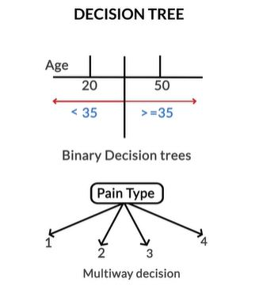

# Tree Models

## Introduction to Decision Trees
Welcome to the module ‘Tree Models’. In this module, we will study two extremely popular machine learning models —  **decision trees and random forests**. 

You will begin with **decision trees** and move on to **random forests**, which are a collection of multiple decision trees. A collection of multiple models is called an **ensemble**.

With high interpretability and an intuitive algorithm, decision trees mimic the human decision-making process and excel in dealing with categorical data. Unlike other algorithms such as logistic regression or SVMs, decision trees do not find a linear relationship between the independent and the target variable. Rather, they can be used to **model highly nonlinear data.**

With decision trees, you can easily explain all the factors leading to a particular decision/prediction. Hence, they are easily understood by business people. They form the building blocks for random forests, which are very popular algorithms among the kaggle community.

Random forests, being **collections of multiple trees**, are one of the most successful and popular models in machine learning. By the end of this module, you will be able to use decision trees and random forests to solve classification problems.

## Introduction to Decision Trees
As the name goes, a decision tree uses a tree-like model to make predictions. It resembles an upside-down tree. It is also very similar to how you make decisions in real life: you ask a series of questions to arrive at a decision.

A decision tree splits the data into multiple sets. Then, each of these sets is further split into subsets to arrive at a decision.

For instance if a doctor is trying to make a decision about what the line of treatment will be for a patient visiting the doctor, what the diagnosis is based on the patient condition. The typical thought process in the doctor's mind would probably goes something like this:

Essentally we can imagine the decision making process by a doctor as a series of nested if and then else. If something happens then do something else do something else. So its very easy to imagine it as a tree, which is what a decision tree is.

We saw that decision trees use a very natural decision-making process: asking a series of questions in a nested if-then-else structure. Let’s look at some real examples and understand trees better.

On each node, you ask a question to further split the data held by the node. If the test passes, you go left; otherwise, you go right.In the heart disease example shown above, the leaf nodes (bottom) are labelled yes (the person has heart disease) or no (the person doesn’t have heart disease).

The decision tree predicts that if, ‘Thal’ is not equal to 3, ‘coloured fluoroscopy’ is less than 0.5, ‘exercise.angina’ is equal to 0, and ‘age’ is less than 51, then the person will have heart disease. Similarly, there are three other paths which lead to a yes labelled leaf.

## Interpreting a Decision Tree
Now if a model predicts that a data point belongs to class A, how do you figure out which attributes were the most important predictors? Decision trees make it very easy to determine the important attributes. Let’s understand this with an example.

So, if a test splits the data into more than two partitions, this is called a **multiway decision tree**.  
The decision trees are easy to interpret. Almost always, you can identify the various factors that lead to the decision. In fact, trees are often underestimated for their ability to relate the predictor variables to the predictions. As a rule of thumb, if interpretability by laymen is what you're looking for in a model, decision trees should be at the top of your list.

So the decision trees can go back and tell you the factors leading to a given decision. In SVMs, if a person is diagnosed with heart disease, you cannot figure out the reason behind the prediction. However, a decision tree gives you the exact reason, i.e. either 'Thal is 3, the pain type is neither 1, nor 2, nor 3, and the coloured fluoroscopy is greater than or equal to 0.5', or 'Thal is not equal to 3, and either of the three tests, shown in the right half of the tree, failed'.

Consider the heart disease decision tree again. Given that a patient is diagnosed with heart disease, you can easily trace your way back to the multiple tests that would have led to this diagnosis. One such case could be where the patient doesn’t have thal = 3, and coloured fluoroscopy is greater than or equal to 0.5.

In other words, each decision is reached via a path that can be expressed as a series of ‘if’ conditions satisfied together, i.e., **if** ‘thal’ is not equal to 3, and **if** coloured fluoroscopy is greater than or equal to 0.5, then the patient has heart disease. Final decisions in the form of class labels are stored in leaves.

### Comprehension - Decision Tree Classification in Python
Let’s look at the heart disease data set we discussed in the lecture. The data lists various tests that were conducted on patients and some other details. Now you want to predict if a person has heart disease or not, given the test results and other attributes.

[Heart Disease Data Set](dataset/heart.csv)

For a better understanding of the data set, please check the attribute information on the UCI website (https://archive.ics.uci.edu/ml/datasets/Statlog+%28Heart%29).

Heart disease = 1 means the person **doesn’t have** heart disease  
Heart disease = 2 means the person **has** heart disease

For simplicity and to focus on building a decision tree only, we are skipping any EDA or feature manipulation. Also, the entire data set has been used as the **training set**. Just run the given Python notebook and build the decision tree on the **entire data set**, using the **default parameters** of the  DecisionTreeClassifier() function.

[Python Code](dataset/Decision+Tree---Heart+Disease.ipynb)